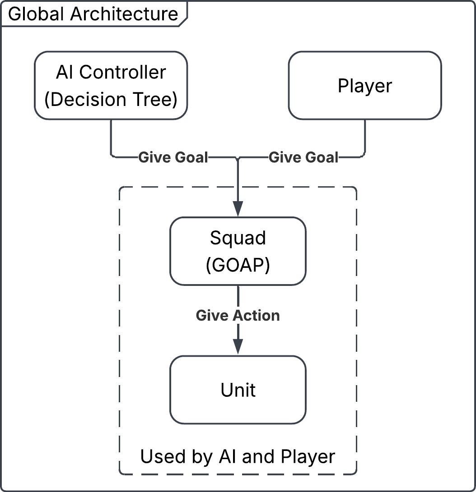
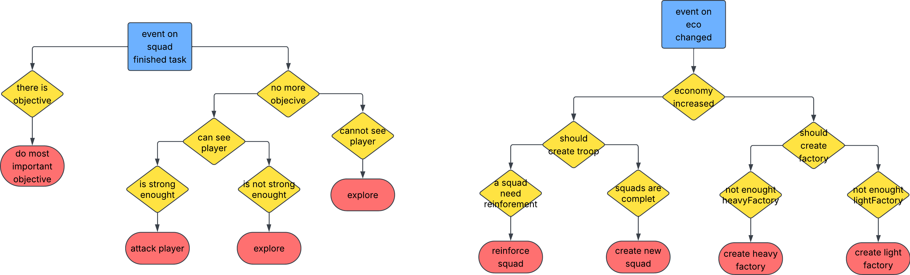
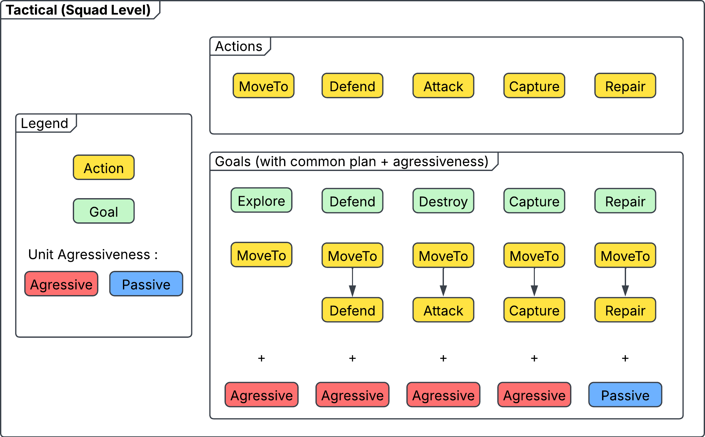
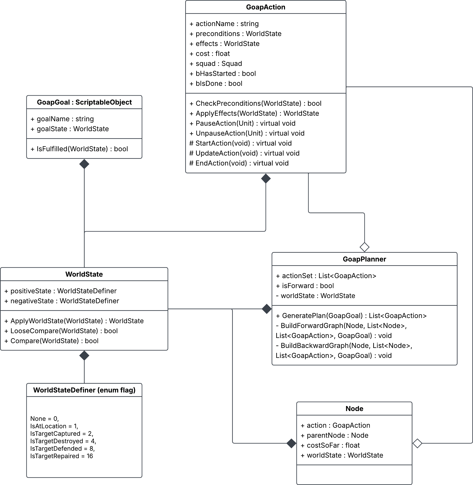
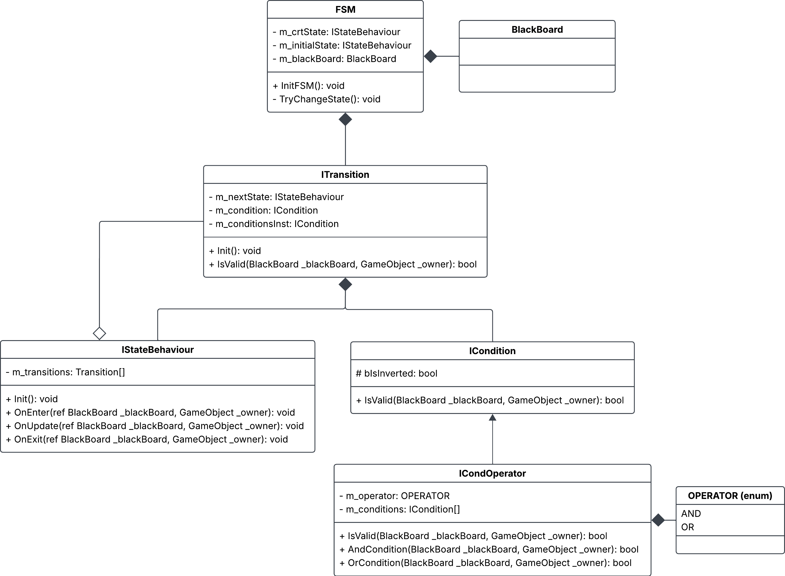
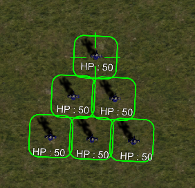
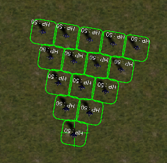
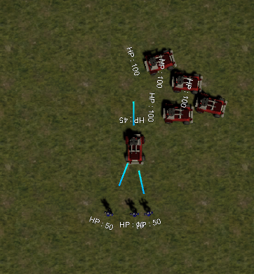

# RTS AI

## Table Of Content
- [About the project](#about-the-project)
- [AI Architecture](#ai-architecture)
  - [Strategical](#strategical)
  - [Tactical / Squad](#tactical--squad)
  - [Unit](#unit)
  - [Finite State Machine](#finite-state-machine)
- [Screenshots](#screenshots)
- [Softwares](#softwares)
- [Credits](#credits)
- [Sources](#sources)

## About the project
This project was made by 3 Game Programmer students at Isart Digital during 2 weeks (started on `22 June 2026` and finished on `02 July 2026`). 
The goal was to develop an `AI` capable of playing against the player in a `Real-Time Strategie` (RTS) game and also controlling player units. 
We have used a template given by `Isart Digital`, which contains the base of the RTS game (Scene, Units, Factory, Resources System...).

## AI Architecture
|  | 
|:--:| 
| *Global Architecture of the AI* | 

- ### Strategical
The `strategical` part of our game is only used by the enemy AI. It is used to manage the opponent resources, create factory/squad and give goals to squad. 
We have decided to split the `strategical system` into two. The first part is designed to create a factory and squad. And the second part determines the `goal` of each squad. 
The two parts use a `decision tree` (DT) to make decisions according to the current state of the game.

|  | 
|:--:| 
| *Diagram of Strategical decision* |

- ### Tactical / Squad
The `squad` possesses all units and controls them. It uses a `Goal Oriented Action Planner` (GOAP) to establish a plan and give action to the unit. The goal is determined and received from the startegical layer (or the player inputs for the player's squads). 
It also determines the formation for the units by giving them an offset in the NavMeshAgent destination. 
For example: it will generate a plan to capture a building with the following actions: MoveTo, Capture

|  | 
|:--:| 
| *Diagram of Tactical decision* |

- ### GOAP
The planner stores the `world state` as a class WorldState, composed of two `enum flags` (WorldStateDefiner), to allow for `bitwise operations` when comparing or modifying the world state. The two enum flags are used as a positive and negative world state descriptor, meaning the "true" values of the positive one represent what is true in the world state and the "true" values of the negative one represent what is false in the world state. When a value is "false" in either one, it means that the value is not taken into account.

The `goals` are `Scriptable Objects`, in which you can setup the name, the desired WorldState and the need for `agressiveness` of the units trying to achieve the goal.

The `actions` inherit from GoapAction, and can override 3 functions (StartAction, UpdateAction and EndAction) to define their behavior.

|  | 
|:--:| 
| *UML of Goal Oriented Action Planner* |

- ### Unit
The `unit` is the smallest layer we can find in the game. It doesn't have any AI; they are controlled by the squad, but they can interrupt their action if something unexpected happens, like an opponent squad in its range of detection. In this case, the unit will stop its current action and try to kill the opponent unit; if it succeeds, it will resume its action and continue its current action.

- ### Finite State Machine
At the beginning of the project, we thought we would need a `Finite State Machine` (FSM). During the project we realized that we didn't need to use it, but we already implemented it.

|  | 
|:--:| 
| *UML of Finite State Machine* |

## Screenshots
|  |  | 
|:--: |:--: | 
| *RTS-Formation 1* | *RTS-Formation 2* |

|  | 
|:--: |
| *RTS-Fight 1* |

## Softwares
- Engine: [Unity 6000.3.13f1](https://unity.com/fr/releases/editor/whats-new/6000.3.13f1)
- IDE: [Visual Studio Community 2026](https://visualstudio.microsoft.com/fr/downloads/)
- Versionning: [Gitlab](https://about.gitlab.com/)

## Credits
### Game Programming
- [Alfred PLANSON](https://github.com/Ego1809)
- [Arthur GUÉDU](https://github.com/Arthur-GUEDU)
- [Lucas LEPINAY](https://github.com/LucasLEPINAY)
 

## Sources
- https://www.reddit.com/r/starcraft/comments/mtcroy/how_ai_works_in_big_rts_games/
- https://fr.scribd.com/document/539960830/Ecgg15-Chapter-rts-Ai
- https://www.seangoedecke.com/wargame-agents/
- https://www.youtube.com/watch?v=rLe6Jrdqu3w&list=PL4G2bSPE_8ul0VWqaxhv7gm2oXTVFC3as
- https://people.montefiore.uliege.be/fsafadi/nips2011.pdf
- https://github.com/brimetz/CromagnonRTS
- https://github.com/Vincent-Devine/AI_RTS
- https://github.com/e-mateo/RTS
- https://ojs.aaai.org/index.php/AIIDE/article/view/12714
- https://ojs.aaai.org/index.php/AIIDE/article/view/12548
- https://ojs.aaai.org/index.php/AIIDE/issue/view/426
- https://ai.dmi.unibas.ch/_files/teaching/fs16/ai/slides/ai34.pdf
- https://theses.hal.science/tel-04097351/document
